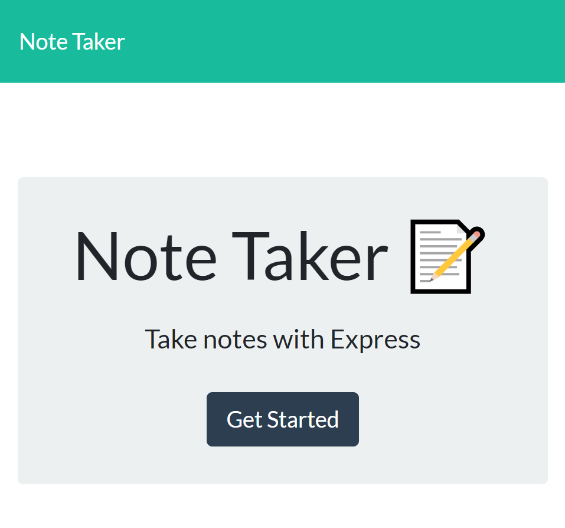
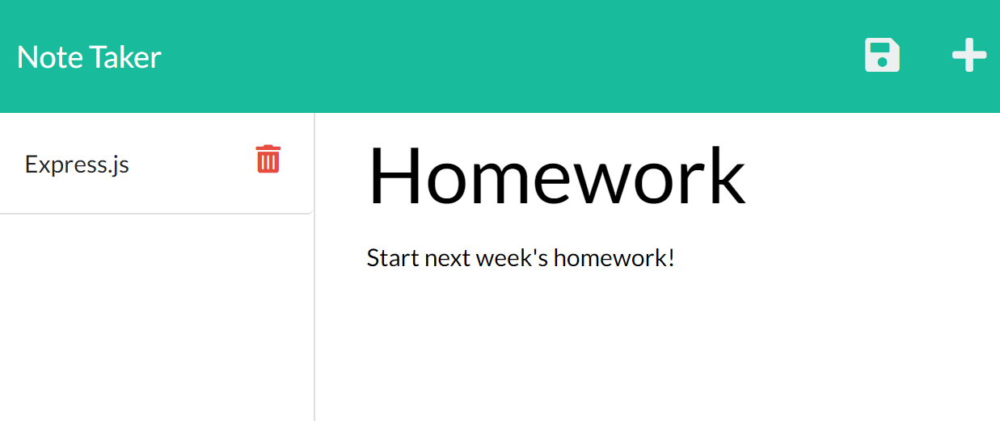

<div align="center">

# Note Taker Application


Built with Express

URL of the Heroku deployed application:

URL of the GitHub repository: https://github.com/rubiocode/Note-Taker

</div>

## Table of Contents 

* [Description](#description)
    * [User Story](#user-story)
    * [Acceptance Criteria](#acceptance-criteria)
* [View](#view)
* [Usage](#usage)
* [Built With](#built-with)
* [Credits](#credits)
* [License](#license)

## Description

The _Note Taker_ is a simple and easy to use application to write and save notes. This application uses Express.js to save and retrieve the data entered in the app. In this application the user is able to organize and keep track of their tasks by writing, saving, viewing, and deleting their notes.

### User Story

```
AS A small business owner
I WANT to be able to write and save notes
SO THAT I can organize my thoughts and keep track of tasks I need to complete
```

### Acceptance Criteria

- [x] Main landing page presents workable links.
- [x] Notes link takes the user to notes html page and presents the user with existing notes.
- [x] When a new note is entered the save button shows at the top of the page.
- [x] When new note saved it appears along previous existing notes.
- [x] When existing note is clicked, it appears on the right side of the screen, then user is able to delete or create new note.  

## View

To view the Heroku deployed webpage click [here]().

This is what the application looks like:

Landing Page: 




Notes Page:



## Usage

In this _Note Taker_ application, the user can write, save, view, and delete notes. 


## Built With

All backend code built with:

* [Express](https://expressjs.com/) - A Node.js web application server framework used to build web applications.

* [FS](https://nodejs.org/dist/latest-v14.x/docs/api/fs.html) - File system module allows the user to interact and work with the file system in the user's computer.

* [JavaScript ES6](https://www.w3schools.com/Js/js_es6.asp) - Programming language that creates dynamic website content. ES6 or ECMAScript 6 was the second major revision to JavaScript.

* [Node.js](https://nodejs.dev/learn/) - Node.js is an open-source, low-level, back-end JavaScript runtime platform that uses asynchronous programming and is a popular tool for almost any kind of project!. 
 

## Credits

All frontend code created by © 2021 Trilogy Education Services, a 2U, Inc. brand. All Rights Reserved.

## License


Copyright 2021 Rubidia Rubio. Licensed under the [MIT License](https://opensource.org/licenses/MIT)

All Rights Reserved. Permission is hereby granted, free of charge, to any person obtaining a copy of this software and associated documentation files (the "Software"), to deal in the Software without restriction, including without limitation the rights to use, copy, modify, merge, publish, distribute, sublicense, and/or sell copies of the Software, and to permit persons to whom the Software is furnished to do so, subject to the following conditions:

The above copyright notice and this permission notice shall be included in all copies or substantial portions of the
Software.

THE SOFTWARE IS PROVIDED "AS IS", WITHOUT WARRANTY OF ANY KIND, EXPRESS OR IMPLIED, INCLUDING BUT NOT LIMITED TO THE
WARRANTIES OF MERCHANTABILITY, FITNESS FOR A PARTICULAR PURPOSE AND NONINFRINGEMENT. IN NO EVENT SHALL THE AUTHORS OR
COPYRIGHT HOLDERS BE LIABLE FOR ANY CLAIM, DAMAGES OR OTHER LIABILITY, WHETHER IN AN ACTION OF CONTRACT, TORT OR
OTHERWISE, ARISING FROM, OUT OF OR IN CONNECTION WITH THE SOFTWARE OR THE USE OR OTHER DEALINGS IN THE SOFTWARE.